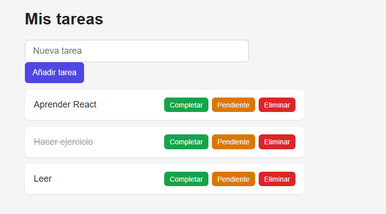

(En la captura la 2ª tarea está completada)

Este repositorio está público pero realmente está pensando para que YO lo entienda con explicaciones a mi manera, posiblemente si alguien ve esto salga con mas dudas que con las que entró pero solo quiero repasar lo ya aprendido o poder venir aqui en un futuro si algo se me olvida

Este proyecto utiliza JavaScript + swc (Speedy Web Compiler) asique hay cosas susceptibles a cambios si se usa typescript

# Clase App.jsx
Cuando algo cambia React NUNCA actualiza toda la pagina, solo lo que es necesario, el useState se encarga de eso, para crearlo se crea una variable que tiene un array con 2 variables, pongamos el ejemplo de tareas y setTareas, tareas es la variable a la que se le va a asignar el valor, setTareas es un metodo que va a encargarse de que tareas funcione, el = useState(tareasIniciales) simplemente le da como valor inicial al useState el array con tareas ya creadas, si hiciesemos un useState para contar cuantas veces se pulsa un boton seria algo asi const [pulsado, setPulsado] = useState(0) <-- se pone 0 pq al principio queremos que muestre que el boton ha sido pulsado 0 veces, basicamente dentro de los parentesis del useState puede ir cualquier cosa, un string, un boolean, un int, o una cadena vacia (como es el caso del useState para añadir tareas)

## funcion addTarea, 
el if dice que si recibe una cadena vacia no haga nada, si la cadena no está vacia creamos una nueva variable, como id le pasamos la fecha de hoy, esto es para no complicarse creando un contador que se incremente cada vez que se crea una tarea, mas que nada se hace asi por pereza, el texto de la tarea será el texto de la variable nuevaTarea del useState, al crearla hacemos que este sin completar por eso el hecha = false
La linea:

setTareas([...tareas, tarea])
Dice: cambiame la lista de tareas, coge la lista que ya existe y añadele al final la variable tarea (la que acabamos de crear) 

## funcion completar/pendiente tarea 

setTareas(tareas.map((tarea) =>
      tarea.id === id ? {...tarea, hecha: false} : tarea))
en react no se puede cambiar el valor de una tarea y ya, hay que crear otro objeto con el/los valores cambiados, para ello le decimos al setTareas, recorre todo el array de tareas y devuelveme un objeto para cada una, esto lo hace el .map, es decir, .map es un for normal pero que automaticamente te hace un return con lo que está recorriendo, eso que devuelve aqui lo llamamos tarea, lo que hacemos es una funcion anonima que recibe un parametro que es tarea, esto es el (tarea) =>, despues de esto decimos, si el id de esa tarea coincide con el que recibe el metodo añade al array de tareas esta misma tarea pero solo cambiando el hecha a false, sino es el mismo añade la propia tarea (es decir, no cambia)

## funcion eliminarTarea

setTareas(tareas.filter((tarea) =>  tarea.id !== id))
es como que le digo al setTareas: oye, vamos a cambiar el valor del array de tareas, antes habia 3, ahora solo va a haber las que pasen el filtro, ese filtro va a ser que si el id que pido en el metodo coincide con el de una tarea esa no lo pasa

esta es mi explicacion con mis palabras, lo se, no es nada formal pero a mi me sirve para entenderlo, ahora necesito que analices bien todo lo que digo, si digo alguna burrada dime, oye, esto no es asi como tu dices
